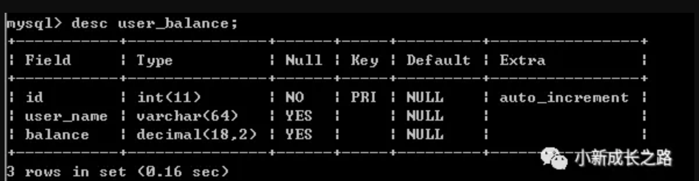
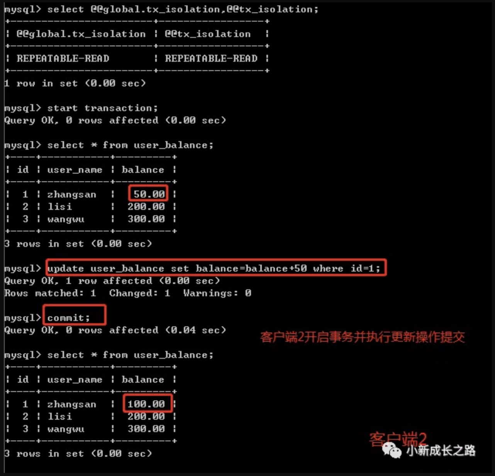

# 数据库事务那些事儿
## 数据库事务原理
天天撸业务代码，很少有时间去关注底层如何实现，因为平时工作中，常用的技术框架（SSM或者SSH框架、服务化、缓存、数据库中间件、消息中间件等）都已经被封装好了，从而程序员只需要关注业务需求如何实现，在搭建好的框架模板里编码业务代码即可。但是，想要提升自己的话，就需要去关注更多的技术细节和底层原理及实现。 本文主要是自己学习数据库事务的笔记（基于mysql数据库），包括事务的特性和隔离级别的定义及应用， 特此记录，加深理解。
### 事务概念
1. 什么是事务？ 数据库中一系列数据操作命令构成的集合，这个集合是一个单元体，称之为事务，构成该集合的命令全部执行成功则全部提交，只要有一条不成功则全部回滚。
2. 数据库并发产生的问题 数据库的基本操作包括：查询、插入、修改、删除，可单条或者批量的执行数据操作 如果单线程的对数据库做这些操作总能得到正确的结果，然而目前应用中对关系型数据库的操作基本都是多线程，如果这些操作并发执行不加以控制的话会产生许多意想不到的问题。

没有事务控制常见的问题如下：
#### 脏读
两个事务T1、T2并发的对同一条数据执行操作，其中T2更新了该条数据还未提交，然后T1读取到了T2更新后的结果，但是T2由于异常或其他原因导致了事务回滚，那么对于T1来说读取到的数据就是无效的，称之为脏数据。

#### 不可重复读
在事务T1中多次读取某条记录，在T1读取期间，另外一个事务T2对该条数据进行了修改并提交，然后造成T1中多次读取的结果不一致。

#### 幻读
事务T1执行条件查询结果集，事务T2插入了新的记录（或者删除了记录），然后T1再次查询结果集的时候发现多了几条数据（或者少了几条数据），在事务T1中发现多次读取结果集返回的行数不一样，像是产生了幻觉一样，这种场景叫做幻读。


> 注意： `脏读`和`不可重复读`都是返回结果不一致，但是`脏读`是事务还未提交，`不可重复读`是事务已经提交了。`不可重复读`和`幻读`也是返回结果不一致，他们明显的区别就是：`不可重复读`是针对更新的操作，而`幻读`主要是插入或删除影响行数的操作。

### 事务特性
事务的特性也称为事务的基本要素（也简称为ACID），有以下几点：
#### 原子性(Atomicity)
事务开始后的所有数据操作构成一个整体，全部执行成功则提交，只要有一条执行不成功则回滚，即要么全做，要么全不做。
#### 一致性(Consistency)
事务操作开始前和事务结束后，数据库中的数据必须保持完整性，数据结构也不能被破坏。
#### 隔离性(Isolation)
多个事务之间是相互隔离的，彼此之间的操作独立执行不会相互影响。
#### 持久性(Durability)
事务操作完成提交后，对数据的修改是永久性的保存到数据库中，即使数据集发生故障，这些数据都是可以恢复的。

### 事务隔离级别
事务具有隔离性，多个事务并发执行互不影响。但是如果串行的执行，会降低资源的利用率，达不到高并发的要求，因此在数据一致性和系统吞吐量之间需要做一个权衡。
sql标准定义了不同的隔离级别，从低到高依次是：
#### 读未提交（Read uncommitted）
这个隔离级别，使得所有事务都能看到其他事务更新未提交的执行结果，称之为“脏读”，不能解决上述数据库并发产生的任何问题，这种级别在实际应用中特别少。
#### 读提交（Read committed）
这个隔离级别使得不同事务之间未提交前只能看到自己的操作结果，只有提交后才能对其他事务可见，解决了“脏读”的问题，但是未解决“不可重复读”的问题。oracle数据库就是默认采用这个隔离级别。
#### 可重复读（Repeatable read）
可重复读确保了在同一事务中多次的读取结果是相同的，解决了“脏读”、“不可重复读”的问题，但是并未解决“幻读”的问题。这是mysql的默认隔离级别，但是mysql使用的innodb存储引擎通过多版本并发控制MVCC（multiversion concurrency control）机制解决了幻读的问题。
#### 串行化（Serializable）
这是最高级的隔离级别，使得所有操作在数据库排队单线程的执行，解决了“脏读”、“不可重复读”、“幻读”的问题，这种级别使得多线程操作时数据库锁竞争较严重，性能较低。
**事务的隔离级别越高，安全性越强，并发能力越低**，各隔离级别解决多事务下产生的不同问题如下：
隔离级别 | 脏读可能性 | 不可重复读可能性 | 幻读可能性
--- | :---: | :---: |:---: 
读未提交（Read uncommitted） | 是 | 是 | 是 
读提交（Read committed） | 否	| 是	| 是 
可重复读（Repeatable read）	| 否	| 否	| 是 
串行化（Serializable）	| 否	| 否	| 否 
> 注意：mysql的可重复读（Repeatable read）使用mvcc解决了幻读的问题。

## mysql数据库事务
### 隔离级别
本次使用的mysql版本为5.5.28，默认使用的隔离级别是：REPEATABLE-READ。
```sql
select @@version;
show variables like '%isolation%';
select @@global.tx_isolation, @@tx_isolation;
```

mysql全局配置事务隔离级别
- windows环境在mysql的配置文件为mysql安装目录my.ini文件
- linux在/etc/my.cnf,如果没有就新建一个文件
Windows和linux都是在[mysqld]下加上一句：
```
transaction-isolation = REPEATABLE-READ（或者READ-UNCOMMITTED,READ-COMMITTED, REPEATABLE-READ, or SERIALIZABLE） 注意：修改mysql配置文件后需要重启才能生效
```
### mysql事务语法
```
mysql可以使用help transaction;查看语法Syntax:
SET [GLOBAL | SESSION] TRANSACTION
    transaction_characteristic [, transaction_characteristic] ...

transaction_characteristic:
    ISOLATION LEVEL level
  | READ WRITE
  | READ ONLY

level:
     REPEATABLE READ
   | READ COMMITTED
   | READ UNCOMMITTED
   | SERIALIZABLE

To 
set the global default isolation level at server startup, use the
--transaction-isolation=level option to mysqld on the command line 
or in an option file. Values of level for this option use dashes rather
than spaces, so the permissible values are READ-UNCOMMITTED,READ-COMMITTED, REPEATABLE-READ, or SERIALIZABLE. For example, to set the default isolation level to REPEATABLE READ, use these lines in the
[mysqld] section of an option file:
[mysqld]
transaction-isolation = REPEATABLE-READ

SELECT @@GLOBAL.transaction_isolation, @@transaction_isolation;
SET GLOBAL transaction_isolation='REPEATABLE-READ';
SET SESSION transaction_isolation='SERIALIZABLE';
```
### mysql事务自动提交
```
查看事务是否自动提交：show variables like 'autocommit'; 设置事物不自动提交 ：set autocommit=0; 或者全局不自动提交：set global autocommit=0;（0:手动提交，1：自动提交）

注意：修改mysql配置文件后需要重启才能生效
```
### 隔离级别实例
创建一张测试用表：
```sql
create table user_balance(
id int not null auto_increment,
user_name varchar(64),
balance decimal(18,2),
primary key (id)
) ENGINE=InnoDB  DEFAULT CHARSET=utf8
```
初始化3条数据
```sql
insert into user_balance(user_name,balance) values('zhangsan',100);
insert into user_balance(user_name,balance) values('lisi',200);
insert into user_balance(user_name,balance) values('wangwu',300);
```

下列操作前最好确认事务不自动提交（因为所有跟事务相关的都把数据库默认的自动提交关闭了）
mysql的配置文件[mysqld]下加一句：init_connect='SET autocommit=0'（mysql5.5以上）、autocommit=0（mysql5.5）
#### 1. 读未提交
mysql的配置文件[mysqld]配置：transaction-isolation = READ-UNCOMMITTED
- 客户端1设置事务隔离级别为读未提交并开启事务查询数据

- 客户端2设置事务隔离级别为读未提交并开启事务修改数据，暂不提交

- 客户端1再次查询数据，发现读取到了客户端2修改且未提交的数据

- 客户端2回滚事务，这时客户端1已经读取的数据其实就是脏数据了

- 这时在客户端1继续更新操作，使用的不是客户端1刚查出来的余额50，而是客户端2回滚后的余额100，要想解决这个问题，可以使用读提交这个隔离级别

#### 2. 读提交
mysql的配置文件[mysqld]配置：transaction-isolation = READ-COMMITTED
- 客户端1设置事务隔离级别为读提交并开启事务查询数据

- 客户端2设置事务隔离级别为读提交并开启事务修改数据，暂不提交

- 这时客户端1查询不到客户端2修改的数据，说明读提交这个隔离级别解决了脏读的问题

- 客户端2事务提交

- 客户端1继续查询，发现与上一次查询的结果不同，说明读取到了客户端2提交的数据，但是产生了不可重复读的问题

#### 3. 可重复读 
mysql的配置文件[mysqld]配置：transaction-isolation = REPEATABLE-READ
- 客户端1开启事务并查询数据

- 客户端2开启事务并修改数据并提交

- 客户端1再次查询，结果没有改动，没有出现不可重复读问题

- 客户端1接着执行更新操作，数据一致性没有被破坏，可重复读的隔离级别下使用了MVCC机制，select操作不会更新版本号，是快照读（历史版本）；insert、update和delete会更新版本号，是当前读（当前版本）。

- 在客户端2插入一条记录并提交

- 在客户端1中查询所有记录，并没有查出客户端2新增的数据，说明没有出现幻读（mysql的可重复读解决了幻读的问题）

#### 4. 串行化
mysql的配置文件[mysqld]配置：transaction-isolation = SERIALIZABLE
- 客户端1开启事务并查询

- 客户端2开启事务并插入数据，需要等待客户端1释放锁，若未释放锁则超时


- 客户端1释放锁后客户端2才能插入数据并提交

- 客户端1等待客户端2提交完成后可查看数据

串行化对于mysql数据库来说是单线程执行的，对并发客户端来说相当于需要排队获取到锁后才能执行。
## 总结
数据库的隔离级别不同，可解决并发操作产生的问题也不同，隔离级别越高，并发效率越低，但是隔离级别越低，容易产生脏数据和数据不一致，这在生产环境试不能接受的。
事务使用时需要根据业务场景，选择合适的隔离级别，同时在应用端做好事务方面的控制。
目前spring已对事务做了封装，很好的解决了底层事务问题，让程序员从复杂的事务中解脱出来，更关注业务需求的开发，但应学习spring是如何实现及解决问题的，对自己更是一种提升。