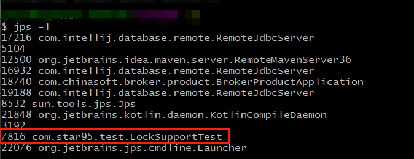

阅读本文前，需要储备的知识点如下，点击链接直接跳转。
[java线程详解](../thread/thread.md)
[Java不能操作内存？Unsafe了解一下](../Unsafe/Unsafe.md)

## LockSupport介绍
搞java开发的基本都知道J.U.C并发包（即java.util.concurrent包），所有并发相关的类基本都来自于这个包下，这个包是JDK1.5以后由祖师爷Doug Lea写的，`LockSupport`也是在这时诞生的，在JDK1.6又加了些操作方法。
其实`LockSupport`的这些静态方法基本都是调用`Unsafe`类的方法，所以建议大家看看文章开头的Unsafe那篇文章。
首先我们来看看`LockSupport`类开头的一段注释。

```java
/**
 * Basic thread blocking primitives for creating locks and other
 * synchronization classes.
 *
 * <p>This class associates, with each thread that uses it, a permit
 * (in the sense of the {@link java.util.concurrent.Semaphore
 * Semaphore} class). A call to {@code park} will return immediately
 * if the permit is available, consuming it in the process; otherwise
 * it <em>may</em> block.  A call to {@code unpark} makes the permit
 * available, if it was not already available. (Unlike with Semaphores
 * though, permits do not accumulate. There is at most one.)
```
大概的意思就是说，`LockSupport`这个类用于创建锁和其他同步类的基本线程阻塞原语。这个类与使用它的每个线程关联一个许可证，这个许可证数量不会累积。最多只有一个即permit要么是0要么是1，如果调用`park`方法，permit=1时则当前线程继续执行，否则没有获取到许可证，阻塞当前线程；调用`unpark`方法会释放一个许可，把permit置为1，连续多次调用`unpark`只会把许可证置为1一次，被阻塞的线程获取许可后继续执行。
额，可能刚开始接触这个类的童鞋有点懵逼，不过没关系，下面我为大家准备了饮料小菜花生米，诸位搬好小板凳，静静的听我吹牛逼吧，哈哈。

## API
`LockSupport`类只有几个静态方法，构造方法是私有的，所以使用的过程中就调用它的这几个静态方法就够了。

- 单纯的设置和获取阻塞对象。
```java
// 给线程t设置阻塞对象为arg，以便出问题时排查阻塞对象，这个方法为私有方法，其他park的静态方法会调用这个方法设置blocker
private static void setBlocker(Thread t, Object arg)
// 获取线程t的阻塞对象，一般用于排查问题
public static Object getBlocker(Thread t)
```
- 单纯的阻塞和给线程释放许可
```java
// 阻塞当前线程，如果已经获取到许可则不阻塞继续执行，这个阻塞可以响应中断
public static void park()
// 释放线程thread的许可，使得thread线程从park处继续向后执行，如果threa为null不做任何操作
public static void unpark(Thread thread)
```
- 只带时间的阻塞
```java
// 阻塞线程，设置了等待超时时间，单位是纳秒，是相对时间，nanos<=0不会阻塞，相当于没有任何操作；nanos>0时，如果等待时间超过nanos纳秒还没有获取到许可，那么线程自动恢复执行
public static void parkNanos(long nanos)
// 这里的deadline单位是毫秒，而且是绝对时间，调用后会阻塞到指定的绝对时间如果还没有获取到许可则自动恢复执行
public static void parkUntil(long deadline)
```
- 同时带阻塞对象和时间的阻塞
```java
// 默认的许可permit=0，阻塞当前线程，并设置阻塞对象为blocker其实就是调用setBlocker这个私有方法。如果当前线程的permit=1了那么再调park是不会阻塞的，因为可以获取到许可继续执行。当前线程获取到许可后会清除blocker为null
public static void park(Object blocker)
// 作用同park(Object blocker)方法，唯一的区别就是设置了等待超时时间，单位是纳秒，是相对时间，nanos<=0不会阻塞，相当于没有任何操作；nanos>0时，如果等待时间超过nanos纳秒还没有获取到许可，那么线程自动恢复执行，例如nanos=1000*1000*1000，这个相当于1秒，等到1秒后如果还没有获取到许可醒则自动恢复
public static void parkNanos(Object blocker, long nanos)
// 作用同parkNanos(Object blocker, long nanos)，设置阻塞对象blocker，但是这里的deadline单位是毫秒，而且是绝对时间，调用了parkUntil后会阻塞到指定的绝对时间如果还没有获取到许可则自动恢复执行
public static void parkUntil(Object blocker, long deadline)
```
- 其他（别问，问我也不知道）
```java
// 返回伪随机初始化或更新的辅助种子。由于包访问限制，从ThreadLocalRandom复制。PS:这是百度翻译的，平时用得少，我也没用过，暂且先放这里吧，用到了再细讲
static final int nextSecondarySeed()
```
关于`LockSupport`的park相关方法阻塞，有以下三种方法可获取到许可并继续向后执行。
1. 主动调用unpark(Thread thread)方法，使得线程获得许可继续执行。
2. 中断该线程即调用interrupt()方法，调用后线程不会抛出异常，直接从park的地方恢复过来继续执行
3. 无原因的虚拟的返回，这种情况目前没有遇到过，不过在java.util.concurrent.locks.LockSupport.park()的注释里会有这种情况
## 使用案例
- 基础的阻塞和释放许可
```java
public static void test1() throws Exception {
    DateTimeFormatter dateTimeFormatter = DateTimeFormatter.ofPattern("yyyy-MM-dd HH:mm:ss");
    Thread t = new Thread(new Runnable() {
        @Override
        public void run() {
            System.out.println(LocalDateTime.now().format(dateTimeFormatter) + ":"
                + Thread.currentThread().getName() + " is running...");
            // 调用park()方法会一直阻塞直到获得permit或者被中断
            LockSupport.park();
            System.out.println(LocalDateTime.now().format(dateTimeFormatter) + ":"
                + Thread.currentThread().getName() + " get permit");
        }
    }, "t1");
    t.start();
    Thread.sleep(2000);
    // 使得被阻塞的线程继续执行有三种方法
    // 1、主动调用unpark(Thread thread)方法，使得线程获得许可继续执行
    LockSupport.unpark(t);
    // 2、中断该线程即调用interrupt()方法，调用后线程不会抛出异常，直接从park的地方恢复过来继续执行
    // t.interrupt();
    // 3、无原因的虚拟的返回，这种情况目前没有遇到过，不过在java.util.concurrent.locks.LockSupport.park()的注释里会有这种情况
}
```
输出如下：
```
2020-05-19 20:25:16:t1 is running...
2020-05-19 20:25:18:t1 get permit
```
- 设置和获取阻塞对象
```java
public static void test2() throws Exception {
    DateTimeFormatter dateTimeFormatter = DateTimeFormatter.ofPattern("yyyy-MM-dd HH:mm:ss");
    Thread t = new Thread(new Runnable() {
        @Override
        public void run() {
            System.out.println(LocalDateTime.now().format(dateTimeFormatter) + ":"
                + Thread.currentThread().getName() + " is running...");
            // 设置线程的阻塞对象为一个字符串
            LockSupport.park("i am blocker");
            System.out.println(LocalDateTime.now().format(dateTimeFormatter) + ":"
                + Thread.currentThread().getName() + " get permit");
        }
    }, "t1");
    t.start();
    Thread.sleep(2000);
    // 获取t线程的阻塞对象，如果没有设置线程t的阻塞对象，则获取到的blocker是null
    Object blocker = LockSupport.getBlocker(t);
    System.out.println(LocalDateTime.now().format(dateTimeFormatter) + ":" + Thread.currentThread().getName()
        + " get block class type:" + blocker.getClass());
    System.out.println(LocalDateTime.now().format(dateTimeFormatter) + ":" + Thread.currentThread().getName()
        + " get block value toString:" + blocker);
    LockSupport.unpark(t);
}
```
输出：
```
2020-05-19 20:32:00:t1 is running...
2020-05-19 20:32:02:main get block class type:class java.lang.String
2020-05-19 20:32:02:main get block value toString:i am blocker
2020-05-19 20:32:02:t1 get permit
```
- 带相对和绝对时间的阻塞
```java
public static void test3() throws Exception {
    DateTimeFormatter dateTimeFormatter = DateTimeFormatter.ofPattern("yyyy-MM-dd HH:mm:ss");
    Thread t1 = new Thread(new Runnable() {
        @Override
        public void run() {
            System.out.println(LocalDateTime.now().format(dateTimeFormatter) + ":"
                + Thread.currentThread().getName() + " is running...");
            // 设置线程的阻塞对象为一个字符串，并且阻塞3s，这里是相对时间，如有没有被unpark或者线程中断，3s后自动恢复执行
            LockSupport.parkNanos("block1", TimeUnit.SECONDS.toNanos(3));
            System.out.println(LocalDateTime.now().format(dateTimeFormatter) + ":"
                + Thread.currentThread().getName() + " continue...");
        }
    }, "t1");
    t1.start();
    Thread t2 = new Thread(new Runnable() {
        @Override
        public void run() {
            System.out.println(LocalDateTime.now().format(dateTimeFormatter) + ":"
                + Thread.currentThread().getName() + " is running...");
            // 设置线程的阻塞对象为一个字符串，并且阻塞5s，这里使用的是绝对时间，只到当前时间+5s转换为毫秒，如有没有被unpark或者线程中断，绝对时间到后自动恢复执行
            LockSupport.parkUntil("block2", System.currentTimeMillis() + TimeUnit.SECONDS.toMillis(5));
            System.out.println(LocalDateTime.now().format(dateTimeFormatter) + ":"
                + Thread.currentThread().getName() + " continue...");
        }
    }, "t2");
    t2.start();
}
```
输出结果：
```
2020-05-20 08:35:07:t2 is running...
2020-05-20 08:35:07:t1 is running...
2020-05-20 08:35:10:t1 continue...
2020-05-20 08:35:12:t2 continue...
```

```
关于park阻塞的方法，针对于阻塞时间总结一下，有三种使用情况情况。
- 无限期阻塞，不带任何时间相关的参数，这种底层调用的是UNSAFE.park(false, 0L)。
- 相对时间阻塞，调用的parkNanos相关方法，这里的时间参数是一个相对时间，单位是纳秒，这种底层调用的是UNSAFE.park(false, nanos)，表示经过nanos纳秒后如果还未获取到许可则自动恢复执行。
- 绝对时间阻塞，调用的parkUntil相关方法，这里的时间参数是一个绝对时间，单位是毫秒，这种底层调用的是UNSAFE.park(true, deadline)，表示把当前时间换算成毫秒，如果值等于deadline毫秒后未获取到许可则自动恢复执行。
```
## 与对象锁比较
`LockSupport`与对象锁主要区别如下：
1. 关注维度不同
LockSupport是针对于线程级别的，而对象锁是`synchronized`关键字配合object对象的notify()、notifyAll()和wait()方法使用的，这种是针对于对象级别的。两者阻塞方式不同，我们看个栗子吧。
```java
public static void test4() throws Exception {
    Thread t1 = new Thread(new Runnable() {
        @Override
        public void run() {
            LockSupport.park();
        }
    }, "t1");
    t1.start();
    Thread t2 = new Thread(new Runnable() {
        @Override
        public void run() {
            try {
                Object obj = new Object();
                synchronized (obj) {
                    obj.wait();
                }
            } catch (Exception e) {
                e.printStackTrace();
            }
        }
    }, "t2");
    t2.start();
}
```
上面这段代码创建了两个线程，t1使用LockSupport.park()阻塞，t2使用obj.wait()阻塞，调用这个方法执行后，我们看看jvm的线程信息。
- 先用`jps`找到对应的进程

- 使用`jstack`查看线程信息

从这个dump的线程堆栈信息我们可以看出，t1和t2线程都处于`WATING`状态，但是t1是阻塞在了Unsafe.park方法上，parking状态，等待获取许可，t2是阻塞在Object.wait方法上，在等待一个object monitor即对象锁。
2. 唤醒方式不同
LockSupport是唤醒指定的线程，而notify()或者notifyAll()无法指定要唤醒的线程，只是表明对象上的锁释放了，让其他等待该锁的线程继续竞争锁，至于哪个线程先获取到锁是随机的，只是将获取到锁的线程由阻塞等待状态变成就绪状态，等待操作系统的调度才能继续执行。
3. 使用方式不同
LockSupport的park阻塞方式是在当前线程中执行并阻塞当前线程，但是唤醒unpark方法是在其他线程中执行的，并且唤醒后被park阻塞的方法能立即继续执行。但是notify或者notifyAll方法虽然调用后起到了通知释放对象锁的作用，但是他必须退出`synchronized`后才生效，下面我们分别看两个栗子。
LockSupport的park和unpark
```java
public static void test5() throws Exception {
    DateTimeFormatter dateTimeFormatter = DateTimeFormatter.ofPattern("yyyy-MM-dd HH:mm:ss");
    Thread lockSupportThread1 = new Thread(new Runnable() {
        @Override
        public void run() {
            System.out.println(LocalDateTime.now().format(dateTimeFormatter) + ":"
                + Thread.currentThread().getName() + " is go parking...");
            LockSupport.park();
            System.out.println(LocalDateTime.now().format(dateTimeFormatter) + ":"
                + Thread.currentThread().getName() + " continue...");
        }
    }, "lockSupportThread1");
    // 让lockSupportThread1线程先执行起来
    lockSupportThread1.start();
    Thread lockSupportThread2 = new Thread(new Runnable() {
        @Override
        public void run() {
            try {
                System.out.println(LocalDateTime.now().format(dateTimeFormatter) + ":"
                    + Thread.currentThread().getName() + " is running...");
                // 让当前线程休眠1s
                Thread.sleep(1000);
                // unpark线程lockSupportThread1
                LockSupport.unpark(lockSupportThread1);
                // 让当前线程休眠3s
                Thread.sleep(3000);
                System.out.println(LocalDateTime.now().format(dateTimeFormatter) + ":"
                    + Thread.currentThread().getName() + " over...");
            } catch (Exception e) {
                e.printStackTrace();
            }
        }
    }, "lockSupportThread2");
    lockSupportThread2.start();
}
```
输出：
```
2020-05-21 12:11:27:lockSupportThread2 is running...
2020-05-21 12:11:27:lockSupportThread1 is go parking...
2020-05-21 12:11:28:lockSupportThread1 continue...
2020-05-21 12:11:31:lockSupportThread2 over...
```
这里我们看到lockSupportThread2线程调用LockSupport.unpark后，虽然有休眠，但是lockSupportThread1线程还是立即执行了，说明LockSupport.unpark是立即释放线程许可。
接下来我们看下Object的wait()和notifyAll()。
```java
public static void test6() {
    DateTimeFormatter dateTimeFormatter = DateTimeFormatter.ofPattern("yyyy-MM-dd HH:mm:ss");
    Object object = new Object();
    Thread lockSupportThread3 = new Thread(new Runnable() {
        @Override
        public void run() {
            try {
                synchronized (object) {
                    System.out.println(LocalDateTime.now().format(dateTimeFormatter) + ":"
                        + Thread.currentThread().getName() + " is running...");
                    // 释放object锁让其他线程可以获得，当前线程阻塞
                    object.wait();
                    System.out.println(LocalDateTime.now().format(dateTimeFormatter) + ":"
                        + Thread.currentThread().getName() + " over...");
                }
            } catch (Exception e) {
                e.printStackTrace();
            }
        }
    }, "lockSupportThread3");
    lockSupportThread3.start();
    Thread lockSupportThread4 = new Thread(new Runnable() {
        @Override
        public void run() {
            try {
                // 让当前线程休眠2s，确保lockSupportThread3先获取到object锁
                Thread.sleep(2000);
                synchronized (object) {
                    System.out.println(LocalDateTime.now().format(dateTimeFormatter) + ":"
                        + Thread.currentThread().getName() + " is running...");
                    // 让当前线程休眠1s
                    Thread.sleep(1000);
                    // 唤醒等待在object锁上的线程
                    object.notifyAll();
                    // 让当前线程休眠3s
                    Thread.sleep(3000);
                    System.out.println(LocalDateTime.now().format(dateTimeFormatter) + ":"
                        + Thread.currentThread().getName() + " over...");
                }
            } catch (Exception e) {
                e.printStackTrace();
            }
        }
    }, "lockSupportThread4");
    lockSupportThread4.start();
}
```
输出结果：
```
2020-05-21 12:16:51:lockSupportThread3 is running...
2020-05-21 12:16:53:lockSupportThread4 is running...
2020-05-21 12:16:57:lockSupportThread4 over...
2020-05-21 12:16:57:lockSupportThread3 over...
```
lockSupportThread4先休眠了2s确保lockSupportThread3先执行并获取到object对象锁，然后lockSupportThread3调用了object.wait()，释放object锁并线程阻塞等待，然后lockSupportThread4获取到了object锁继续执行，虽然lockSupportThread4在休眠和打印输出前调用了notifyAll方法，但是依然是lockSupportThread4的同步块代码执行完成后lockSupportThread3才开始执行。

## 总结
本文中虽然我们只介绍了`LockSupport`的API方法和使用案例，其实这也是除`synchronized`结合Object的wait()、notify()、notifyAll()来协调多线程同步的另一种方式。而且在只协调多线程的的情况下`LockSupport`会显得更灵活。
另外在jdk的并发包下，有各种锁，比如`ReentrantLock`、 `CountDownLatch`、`CyclicBarrier`等，只要往底层看下源码，可以发现他们都使用了`AbstractQueuedSynchronizer`（简称AQS，抽象队列同步器，后续文章会专门介绍），而`AbstractQueuedSynchronizer`里的线程阻塞和唤醒正是使用的就是`LockSupport`，所以想要搞懂原理，就得把这些一一梳理清楚，最后自然而然就明白了。

说到这里，让我突然想起张三丰教张无忌学太极时的那一段对话。

```
张三丰：“无忌，我教你的还记得多少？”
张无忌：“回太师傅，我只记得一大半”
张三丰：“ 那，现在呢？”
张无忌：“已经剩下一小半了”
张三丰：“那，现在呢？”
张无忌：“我已经把所有的全忘记了！”
张三丰：“好，忘了好，刚才教你的都是错的，重新来吧...”
张无忌：......
```
emmmmm，好像走错片场了，那就江湖再见吧。。。

## 公众号
欢迎关注公众号，不定期的发布java相关的技术文章。

