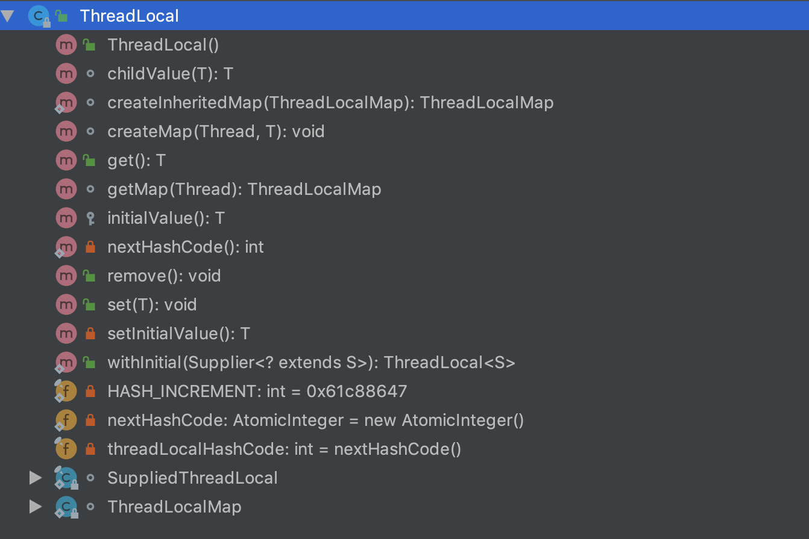
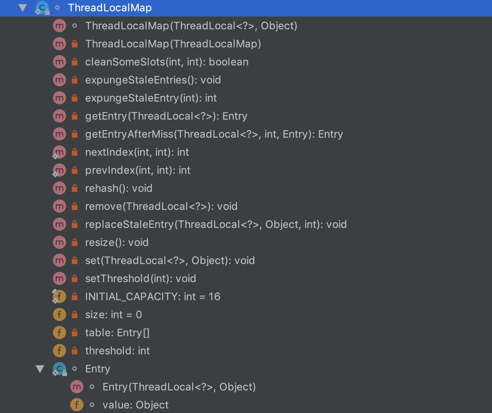
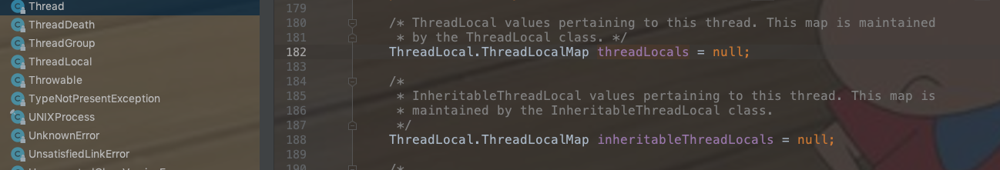

# ThreadLocal源码分析
ThreadLocal的使用大部分场景是创建一个静态的ThreadLocal对象，然后调用set、get方法，最后调用remove方法搞定。回过头来想想，为何调用了set方法后，同一个线程的其他地方get的时候总能拿到set的值？没有同步的变量为何在并发场景下屡次出错？使用完ThreadLocal为何还要调用remove方法？连环异常OOM，究竟是哪次ThreadLocal调用所为？线上数百台服务器意外雪崩背后又隐藏着什么？是软件的扭曲还是硬件的沦丧？ 走进科学带你了解ThreadLocal的底层世界，各位看官请准备好瓜子板凳，且听我一一道来。
## ThreadLocal简介
- ThreadLocal并不是一个Thread，而是Thread的一个局部变量。
- 变量值的共享可以使用public static的形式，所有线程都使用同一个变量，如果想实现每一个线程都有自己的共享变量该如何实现呢？JDK中的ThreadLocal类正是为了解决这样的问题。
- ThreadLocal类并不是用来解决多线程环境下的共享变量问题，而是用来提供线程内部的共享变量，在多线程环境下，可以保证各个线程之间的变量互相隔离、相互独立。在线程中，可以通过get()/set()方法来访问变量。ThreadLocal实例通常来说都是static类型的。这种变量在线程的生命周期内起作用，可以减少同一个线程内多个函数或者组件之间一些公共变量的传递的复杂度。
- ThreadLocal类顾名思义可以理解为线程本地变量。也就是说如果定义了一个ThreadLocal，每个线程往这个ThreadLocal中读写是线程隔离，互相之间不会影响的。它提供了一种将可变数据通过每个线程有自己的独立副本从而实现线程封闭的机制。
## ThreadLocal用法
```java
public class ThreadLocalTest {

    private static ThreadLocal<Integer> threadLocal = new ThreadLocal<>();

    public static void main(String[] args) {
        // 启动两个线程测试
        new DataThread(threadLocal).start();
        new DataThread(threadLocal).start();
    }

    static class DataThread extends Thread {

        private ThreadLocal<Integer> threadLocal;

        public DataThread(ThreadLocal<Integer> threadLocal) {
            this.threadLocal = threadLocal;
        }

        /**
         * 设置值
         *
         * @param data
         */
        private void setData(int data) {
            threadLocal.set(data);
        }

        /**
         * 取值
         *
         * @return
         */
        private int getData() {
            return threadLocal.get();
        }

        @Override
        public void run() {
            for (int i = 0; i < 5; i++) {
                System.out.println(Thread.currentThread().getName() + "设置值：" + i);
                setData(i);
                System.out.println(Thread.currentThread().getName() + "获取值：" + getData());
            }
            threadLocal.remove();
        }
    }
}
```

执行结果：
```
Thread-0设置值：0
Thread-0获取值：0
Thread-0设置值：1
Thread-0获取值：1
Thread-0设置值：2
Thread-0获取值：2
Thread-0设置值：3
Thread-0获取值：3
Thread-0设置值：4
Thread-0获取值：4
Thread-1设置值：0
Thread-1获取值：0
Thread-1设置值：1
Thread-1获取值：1
Thread-1设置值：2
Thread-1获取值：2
Thread-1设置值：3
Thread-1获取值：3
Thread-1设置值：4
Thread-1获取值：4
```

这里我们可以看到实例化了一个ThreadLocal对象，然后启动了两个线程分别执行了5次的set、get方法，每次get总能拿到set后的值，而且两个线程虽然共享了ThreadLocal的实例，并没有出现值错误的情况，如果线程执行完成，最好能再线程执行前显示的调用了一次remove方法，避免OOM，后面会讲到。

## ThreadLocal源码分析
看了以上的用法是不是很简单？那么ThreadLocal是怎么实现变量跟线程绑定的呢，下面我们一起看看源码是怎么实现的。
### ThreadLocal相关API

我们可以看出它没有对外暴露任何`变量`，全部都是`private`私有的，对外暴露的接口（public修饰）如下：

```java
// 无参构造方法，实例化一个ThreadLocal
public ThreadLocal()
// 获取当前线程当前实例ThreadLocal中设置的值
public T get()
// 移除当前线程当前实例ThreadLocal中设置的值
public void remove()
// 设置当前线程的ThreadLocal实例中的值
public void set(T value)
// jdk1.8版本新特性，创建一个ThreadLocal实例
public static <S> ThreadLocal<S> withInitial(Supplier<? extends S> supplier)
```

### SuppliedThreadLocal
这是一个内部类，主要是创建带初始化的ThreadLocal时使用。


```java
// 静态final内部类，继承了ThreadLocal
static final class SuppliedThreadLocal<T> extends ThreadLocal<T> {
	// jdk1.8新特性，是一个FunctionalInterface，只有一个get()返回对象
    private final Supplier<? extends T> supplier;

    SuppliedThreadLocal(Supplier<? extends T> supplier) {
        this.supplier = Objects.requireNonNull(supplier);
    }
			// 覆盖了ThreadLocal的initialValue方法设置初始值
    @Override
    protected T initialValue() {
        return supplier.get();
    }
}
```
在ThreadLocal中使用方式如下：
```java
public static <S> <S> withInitial(Supplier<? extends S> supplier) {
    return new SuppliedThreadLocal<>(supplier);
}
// 用这个方法可以实例化ThreadLocal并设置初始值，这个内部类只会在ThreadLocal中使用，例如：
ThreadLocal<Integer> threadLocal = ThreadLocal.withInitial(() -> 2);
// 这里变量threadLocal实例化完成并设置了初始值2
```

### ThreadLocalMap
ThreadLocalMap是ThreadLocal的一个内部类，所有的操作都是这个类完成的，是ThreadLocal的核心类。

在ThreadLocalMap类中还有一个静态类Entry，键值对的数据结构，key为ThreadLocal实例，value为要存放的值，后面会讲到。

下面介绍一下ThreadLocalMap的核心API接口。
```java
// 设置扩容阈值
private void setThreshold(int len)
// 计算下一个存储的数据下标位置，其实是个环形，使用线性探测法
private static int nextIndex(int i, int len)
// 计算上一个存储的数据下标位置，其实是个环形，使用线性探测法
private static int prevIndex(int i, int len)
// 构造函数：当前ThreadLocal实例和要存放的值为参数
ThreadLocalMap(ThreadLocal<?> firstKey, Object firstValue)
// 从父线程继承过来的ThreadLocalMap构造函数，仅仅是在初始化使用，后期父子线程的ThreadLocalMap各自维护自己的ThreadLocalMap
private ThreadLocalMap(ThreadLocalMap parentMap)
// 获取存放指定ThreadLocal的Entry
private Entry getEntry(ThreadLocal<?> key)
// 未找到指定ThreadLocal的Entry时，采用线性探测法继续查找Entry
private Entry getEntryAfterMiss(ThreadLocal<?> key, int i, Entry e)
// 设置指定ThreadLocal的值
private void set(ThreadLocal<?> key, Object value)
// 删除指定ThreadLocal的Entry
private void remove(ThreadLocal<?> key)
// 替换无效的ThreadLocal的值，并清除无效的Entry
private void replaceStaleEntry(ThreadLocal<?> key, Object value,int staleSlot)
// 清除无效的Entry
private int expungeStaleEntry(int staleSlot)
// 清除区间内无效的Entry
private boolean cleanSomeSlots(int i, int n)
// set方法调用后如果Entry数据里的存放值size大于阈值了要进行一次清除无效的Entry，如果已使用的数组大小仍然大于3/4阈值时需要做扩容
private void rehash()
// 扩容，大小为数组的2倍
private void resize()
// 清除全部无效的Entry，再做rehash会调用
private void expungeStaleEntries()
```
### 源码分析
#### threadLocalHashCode变量
这是ThreadLocal类内部的一个final修饰的变量，查找ThreadLocal在Entry数组中下标时起到关键作用。
```java
private final int threadLocalHashCode = nextHashCode();
private static AtomicInteger nextHashCode = new AtomicInteger();
private static final int HASH_INCREMENT = 0x61c88647;
private static int nextHashCode() {
    return nextHashCode.getAndAdd(HASH_INCREMENT);
}
```
我们可以看到`threadLocalHashCode`的值使用原子类`AtomicInteger`自增外加一个固定值`HASH_INCREMENT`得到的，这个固定值为什么是`0x61c88647`呢，这是一个魔数，在构建ThreadLocalMap的时候会计算存储的下标：`int i = firstKey.threadLocalHashCode & (INITIAL_CAPACITY - 1);`，当我们用`0x61c88647`作为魔数累加为每个ThreadLocal分配各自的ID也就是threadLocalHashCode再与2的幂取模，得到的结果分布很均匀。ThreadLocalMap使用的是线性探测法，均匀分布的好处在于很快就能探测到下一个临近的可用slot，从而保证效率。我们可以做如下测试
```java
private static void test5() {
    getHashIndex(32);
    System.out.println("===========");
    getHashIndex(64);
}

public static void getHashIndex(int len) {
    AtomicInteger atomicInteger = new AtomicInteger();
    int hash_increment = 0x61c88647;
    List<Integer> list = new ArrayList<>();
    for (int i = 0; i < len; i++) {
        list.add(atomicInteger.getAndAdd(hash_increment) & (len - 1));
    }
    System.out.println("数组大小为" + len + "时计算的下标:" + list);
    Collections.sort(list);
    System.out.println("数组大小为" + len + "时计算的下标排序后：" + list);
}
```
得到的结果是：
```
数组大小为32时计算的下标:[0, 7, 14, 21, 28, 3, 10, 17, 24, 31, 6, 13, 20, 27, 2, 9, 16, 23, 30, 5, 12, 19, 26, 1, 8, 15, 22, 29, 4, 11, 18, 25]
数组大小为32时计算的下标排序后：[0, 1, 2, 3, 4, 5, 6, 7, 8, 9, 10, 11, 12, 13, 14, 15, 16, 17, 18, 19, 20, 21, 22, 23, 24, 25, 26, 27, 28, 29, 30, 31]
===========
数组大小为64时计算的下标:[0, 7, 14, 21, 28, 35, 42, 49, 56, 63, 6, 13, 20, 27, 34, 41, 48, 55, 62, 5, 12, 19, 26, 33, 40, 47, 54, 61, 4, 11, 18, 25, 32, 39, 46, 53, 60, 3, 10, 17, 24, 31, 38, 45, 52, 59, 2, 9, 16, 23, 30, 37, 44, 51, 58, 1, 8, 15, 22, 29, 36, 43, 50, 57]
数组大小为64时计算的下标排序后：[0, 1, 2, 3, 4, 5, 6, 7, 8, 9, 10, 11, 12, 13, 14, 15, 16, 17, 18, 19, 20, 21, 22, 23, 24, 25, 26, 27, 28, 29, 30, 31, 32, 33, 34, 35, 36, 37, 38, 39, 40, 41, 42, 43, 44, 45, 46, 47, 48, 49, 50, 51, 52, 53, 54, 55, 56, 57, 58, 59, 60, 61, 62, 63]

```
由此可以看出正是由于`0x61c88647`这个魔数的作用使得hash后的值能均匀的分布在2的幂次方大小数组里，大大降低了hash冲突的问题，这个魔数的选取与斐波那契散列有关，有兴趣的可以参考：https://www.jianshu.com/p/36edfa202182 或者 https://www.cct.lsu.edu/~sidhanti/tutorials/data_structures/page214.html

#### ThreadLocalMap.Entry
```java
static class Entry extends WeakReference<ThreadLocal<?>> {
    /** The value associated with this ThreadLocal. */
    Object value;
    Entry(ThreadLocal<?> k, Object v) {
      super(k);
      value = v;
    }
}
```
这里Entry继承了`WeakReference`，`WeakReference`在Java里是一种弱引用，在JVM内存不够的情况下，发生了GC垃圾回收，这部分的变量是会被回收掉的。
如果这里使用普通的key-value形式来定义存储结构，实质上就会造成节点的生命周期与线程强绑定，只要线程没有销毁，那么节点在GC分析中一直处于可达状态，没办法被回收，而程序本身也无法判断是否可以清理节点。弱引用是Java中四档引用的第三档，比软引用更加弱一些，如果一个对象没有强引用链可达，那么一般活不过下一次GC。当某个ThreadLocal已经没有强引用可达，则随着它被垃圾回收，在ThreadLocalMap里对应的Entry的键值会失效，这为ThreadLocalMap本身的垃圾清理提供了便利。关于Java强引用、软引用、弱引用、虚引用大家可以自行搜索答案。

#### InheritableThreadLocal
```java
public class InheritableThreadLocal<T> extends ThreadLocal<T>
static ThreadLocalMap createInheritedMap(ThreadLocalMap parentMap)
```
InheritableThreadLocal继承了ThreadLocal，InheritableThreadLocal提供了一种父子线程之间的数据共享机制，这里主要是在Thread类里执行init初始化线程的时候调用。
```
if (inheritThreadLocals && parent.inheritableThreadLocals != null)
    this.inheritableThreadLocals = ThreadLocal.createInheritedMap(parent.inheritableThreadLocals);
```

#### ThreadLocalMap
这个ThreadLocalMap是核心类，是一个自定义的类似Map的接口，但是跟HashMap还是有很大区别的，不要理解差了，所有的底层操作就是在这个类里完成的，这里我们重点介绍。
我们先看看ThreadLocal类里几个方法。
```java
public T get() {
    // 获取到当前线程
    Thread t = Thread.currentThread();
    // 获取当前线程的ThreadLocalMap
    ThreadLocalMap map = getMap(t);
    if (map != null) {
        // 找到当前ThreadLocal所在的Entry
        ThreadLocalMap.Entry e = map.getEntry(this);
        if (e != null) {
            @SuppressWarnings("unchecked")
            // 当前ThreadLocal存在，则直接返回value值
            T result = (T)e.value;
            return result;
        }
    }
    // 这里需要注意的是，如果没有调用过set方法，则第一次调用get方法时会返回默认的初始化的值
    return setInitialValue();
}

public void set(T value) {
    // 获取到当前线程
    Thread t = Thread.currentThread();
    // 获取当前线程的ThreadLocalMap
    ThreadLocalMap map = getMap(t);
    // 当前线程的ThreadLocalMap存在，直接设置新值
    if (map != null)
        map.set(this, value);
    else
        // 不存在时需要实例化一个ThreadLocalMap，并把value值放进Entry
        createMap(t, value);
}

public void remove() {
    ThreadLocalMap m = getMap(Thread.currentThread());
    if (m != null)
        m.remove(this);
}

ThreadLocalMap getMap(Thread t) {
    // 直接返回线程的内部变量threadLocals
    return t.threadLocals;
}
```
我们看到这里的get、set、remove方法都是先获取到ThreadLocalMap然后再进行相应的操作，这里`getMap`方法使用的参数就是当前线程对象`Thread.currentThread()`，获取的就是Thread类里的threadLocals变量，这个 变量就是`ThreadLocal.ThreadLocalMap`。

从这里就说明了ThreadLocal.ThreadLocalMap是跟当前线程绑定的，所以存取都是在同一个线程里完成的，相当于线程的本次变量副本，线程隔离，不受其他线程影响。
```java
/**
* The initial capacity -- MUST be a power of two.
* 初始的Entry数组大小是16，必须是2的幂次方，就是之前解释的使用魔数在2的幂次方里做hash能均匀分布
*/
private static final int INITIAL_CAPACITY = 16;

/**
* The table, resized as necessary.
* table.length MUST always be a power of two.
* 这个数组里存储的就是键值对,key为ThreadLocal实例，value就是设置的变量值
*/
private Entry[] table;

/**
* The number of entries in the table.
* Entry数组里已存放的数据大小
*/
private int size = 0;

/**
* The next size value at which to resize.
* 扩容的阈值，一般达到数组长度的2/3就开始扩容
*/
private int threshold; // Default to 0

/**
* Set the resize threshold to maintain at worst a 2/3 load factor.
* 一般达到数据长度的2/3就扩容
*/
private void setThreshold(int len) {
    threshold = len * 2 / 3;
}
```
在ThreadLocal首次放入值的时候会创建ThreadLocalMap实例，ThreadLocal会调用ThreadLocalMap的createMap方法，如下所示。
```java
void createMap(Thread t, T firstValue) {
    t.threadLocals = new ThreadLocalMap(this, firstValue);
}
```
调用的ThreadLocal的构造方法实现是这样的
```java
ThreadLocalMap(ThreadLocal<?> firstKey, Object firstValue) {
    table = new Entry[INITIAL_CAPACITY];
    int i = firstKey.threadLocalHashCode & (INITIAL_CAPACITY - 1);
    table[i] = new Entry(firstKey, firstValue);
    size = 1;
    setThreshold(INITIAL_CAPACITY);
}
```
这里会首先初始化一个Entry数组，然后计算当前ThreadLocal所落在的下标并设置，然后设置扩容阈值，`firstKey.threadLocalHashCode & (INITIAL_CAPACITY - 1)`，对于2的幂作为模数取模，可以用&(2^n-1)来替代%2^n，位运算比取模效率高很多，因为对2^n取模，只要不是低n位对结果的贡献显然都是0，会影响结果的只能是低n位。

下面我们重点看ThreadLocalMap的get、set、remove方法。
```java
private void set(ThreadLocal<?> key, Object value) {
    Entry[] tab = table;
    int len = tab.length;
    // 计算参数ThreadLocal实例所存放的数组下标
    int i = key.threadLocalHashCode & (len-1);
    // 这里使用了循环，如果计算的下标已经有数据了并且不是当前对象，也就是hash冲突了，那么就使用nextIndex线性探测法继续往下找存放位置
    for (Entry e = tab[i];
         e != null;
         e = tab[i = nextIndex(i, len)]) {
        ThreadLocal<?> k = e.get();
        // 如果参数ThreadLocal和计算下标得到的是同一个对象，直接设置value并返回
        if (k == key) {
            e.value = value;
            return;
        }
        // 如果get出来的ThreadLocal为null，前面说了Entry继承了WeakReference，弱引用的ThreadLocal可能被垃圾回收了，所以需要替换掉无效的Entry
        if (k == null) {
            replaceStaleEntry(key, value, i);
            return;
        }
    }
    // 如果以上都不符合时，直接创建一个Entry对象并放入下标i中，累加size，如果没有清除任何无效的Entry并且数据大小超过了阈值threshold，那么需要进行扩容
    tab[i] = new Entry(key, value);
    int sz = ++size;
    if (!cleanSomeSlots(i, sz) && sz >= threshold)
        rehash();
}

private Entry getEntry(ThreadLocal<?> key) {
		// 计算下标
    int i = key.threadLocalHashCode & (table.length - 1);
    Entry e = table[i];
    // 如果下标存放的就是当前ThreadLocal时，直接返回这个Entry，否则使用线性探测法继续查找
    if (e != null && e.get() == key)
        return e;
    else
        return getEntryAfterMiss(key, i, e);
}

// 这个方法就是第一次计算下标没有找到ThreadLocal时，使用线性探测法继续向后查找，如果遇到Entry的key为null的情况，做一次清理
private Entry getEntryAfterMiss(ThreadLocal<?> key, int i, Entry e) {
    Entry[] tab = table;
    int len = tab.length;
    while (e != null) {
        ThreadLocal<?> k = e.get();
        if (k == key)
            return e;
        if (k == null)
            expungeStaleEntry(i);
        else
            i = nextIndex(i, len);
        e = tab[i];
    }
    return null;
}

// 删除ThreadLocal中的值
private void remove(ThreadLocal<?> key) {
    Entry[] tab = table;
    int len = tab.length;
    int i = key.threadLocalHashCode & (len-1);
    // 先计算出hash值确定下标，如果下标的Threadl对象正是查找的对象则将Entry里的value置为null，然后以当前下标为起点执行一次清除无效Entry，垃圾回收时可回收掉，如果当前下标不是该对象则线性探测法继续向后查找。操作类似。
    for (Entry e = tab[i];
         e != null;
         e = tab[i = nextIndex(i, len)]) {
        if (e.get() == key) {
            e.clear();
            expungeStaleEntry(i);
            return;
        }
    }
}

// Entry数组里的size大于扩容阈值时会重新rehash，清除无效Entry后，如果size还大于阈值的3/4时就进行扩容
private void rehash() {
    expungeStaleEntries();
    // Use lower threshold for doubling to avoid hysteresis
    if (size >= threshold - threshold / 4)
        resize();
}
   
// 扩容2倍，一般都是2的幂次方，Entry扩大2倍后，里面的数据会重新计算存储下标，冲突采用线性探测法解决
private void resize() {
    Entry[] oldTab = table;
    int oldLen = oldTab.length;
    int newLen = oldLen * 2;
    Entry[] newTab = new Entry[newLen];
    int count = 0;

    for (int j = 0; j < oldLen; ++j) {
        Entry e = oldTab[j];
        if (e != null) {
            ThreadLocal<?> k = e.get();
            if (k == null) {
                e.value = null; // Help the GC
            } else {
                int h = k.threadLocalHashCode & (newLen - 1);
                while (newTab[h] != null)
                    h = nextIndex(h, newLen);
                newTab[h] = e;
                count++;
            }
        }
    }

    setThreshold(newLen);
    size = count;
    table = newTab;
}
```
还有几个跟垃圾回收后ThreadLocalMap相关处理的方法，主要是set、get方法遇到ThreadLocal为null的情况的一些处理，包括区间清除无效Entry、全量清除无效Entry。
```java
// set方法调用的时候，如果ThreadLocal为null，会触发这个方法，放入新值
private void replaceStaleEntry(ThreadLocal<?> key, Object value,int staleSlot)
// 清除无效的Entry
private int expungeStaleEntry(int staleSlot)
// 清除某一区间无效的Entry
private boolean cleanSomeSlots(int i, int n)
```

## ThreadLocal应用场景
- ThreadLocal在spring、hibernate、mybatis中用来解决数据库连接、事务管理、Session管理等，
- ThreadLocal对象通常用于防止对可变的单实例变量或全局变量进行共享。例如：日期格式化`SimpleDateFormat`或者JDBC的`Connection`等都不是线程安全的，因此，当多个线程应用程序在没有协同的情况下，使用全局变量时，就是线程不安全的。通过将对象保存到ThreadLocal中，每个线程都会拥有自己的对象副本，线程间隔离操作互不影响。
- 其他一些需要程序员在代码中保证线程私有变量副本的实例对象的应该创建ThreadLocal。

## ThreadLocal内存泄漏
- 认为ThreadLocal会引起内存泄漏的说法是因为如果一个ThreadLocal对象被回收了，我们往里面放的value对于【当前线程->当前线程的threadLocals(ThreadLocal.ThreadLocalMap对象）->Entry数组->某个entry.value】这样一条强引用链是可达的，因此value不会被回收。
- 认为ThreadLocal不会引起内存泄漏的说法是因为ThreadLocal.ThreadLocalMap源码实现中自带一套自我清理的机制。
- 这就导致了一个问题，ThreadLocal在没有外部强引用时，发生GC时会被回收，如果创建ThreadLocal的线程一直持续运行，那么这个Entry对象中的value就有可能一直得不到回收，发生内存泄露。
- ThreadLocal在线程池中使用时比如自己创建的线程池或者web服务器（Tomcat等）采用线程池机制，也就是说线程是可以复用的，所以在每次进入的时候都需要重新进行set操作，或者使用完毕以后及时remove掉！
- 如何避免内存泄露呢，既然已经发现有内存泄露的隐患，自然有应对的策略，在调用ThreadLocal的get()、set()可能会清除ThreadLocalMap中key为null的Entry对象，这样对应的value就没有GC Roots可达了，下次GC的时候就可以被回收，当然如果调用remove方法，肯定会删除对应的Entry对象。如果使用ThreadLocal的set方法之后，没有显示的调用remove方法，就有可能发生内存泄露，所以养成良好的编程习惯十分重要，使用完ThreadLocal之后，记得显示调用remove方法。

## 总结
- ThredLocal为每个线程保存一个自己的变量，但其实ThreadLocal本身并不存储变量，变量存储在线程自己的实例变量ThreadLocal.ThreadLocalMap threadLocals中
- ThreadLocal的设计并不是为了解决并发问题，而是解决一个变量在线程内部的共享问题，在线程内部处处可以访问
- 因为每个线程都只会访问自己ThreadLocalMap 保存的变量，所以不存在线程安全问题
- ThreadLocal源码相对较少，很适合作为入门源码分析，建议多看几遍，很多其他框架里都大量的使用了ThreadLocal，掌握了ThreadLocal后理解其他的框架应用设计思想就容易多了。

## 公众号
欢迎关注公众号，不定期的发布java相关的技术文章。

