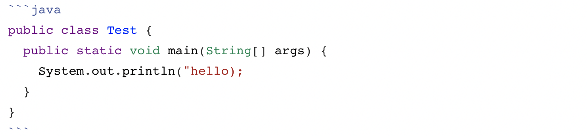

# markdown语法
## 简介
Markdown是一种可以使用普通文本编辑器编写的标记语言，通过简单的标记语法，它可以使普通文本内容具有一定的格式。
语法简单，效果高亮，功能强大，目前主流的一些网站均已支持markdown语法，是程序员写作的不二之选。
下面开始学习markdown的相关语法。

## 内联HTML
markdown并不能替代html，但是它支持HTML标签元素,大多数的HTML标签可以直接使用。
### 行级元素
HTML的行集标签可以直接使用，例如：`span`、`a`等
比如：

```
<a href="http://www.baidu.com">baidu</a>
```
效果：
<a href="http://www.baidu.com">baidu</a>

### 块级元素
但是，唯一的限制是块级HTML元素-例如，`<div>`、`<table>`、`<pre>`、`<p>`等-必须用空行与周围内容分隔，并且块的开始和结束标记不应使用制表符或空格缩进。
比如：

```
下面是一个表格

<table>
	<tr>
		<td>序号</td>
		<td>姓名</td>
		<td>年龄</td>
	</tr>
	<tr>
		<td>1</td>
		<td>张三</td>
		<td>12</td>
	</tr>
	<tr>
		<td>2</td>
		<td>李四</td>
		<td>20</td>
	</tr>
</table>

上面就是表格
```
效果：
下面是一个表格

<table>
	<tr>
		<td>序号</td>
		<td>姓名</td>
		<td>年龄</td>
	</tr>
	<tr>
		<td>1</td>
		<td>张三</td>
		<td>12</td>
	</tr>
	<tr>
		<td>2</td>
		<td>李四</td>
		<td>20</td>
	</tr>
</table>

上面就是表格
### 特殊字符及转义
在HTML中，有两个字符需要特殊处理：<和&。左尖括号用于开始标记；和号用于表示HTML实体。如果要将它们用作文字字符，则必须将它们作为实体进行转义，例如`&lt;`和`&amp;`。
## 块级元素
### 标题
markdown支持两种风格的标题
- 第一种
使用多个`=`或者`-`，`=`的相当于1级标题，`-`的相当于2级标题。
比如：

效果：


- 第二种
使用`#`，支持1--6级标题，对应的标题等级需要使用对应个数的`#`,（`#`号后可以使用1个空格分隔）。
比如：

效果：


### 块级引用
- 基本使用
使用 `>`放在每一行的最前面(可用空格分隔)，显示的效果就是签名加了竖线，如果是多行的话，可以只在第一行加`>`或者每一样都加，效果一样，直到需要空行为止。
比如：
```
> 我是张三
> 性别男
> 年龄20
```
效果：
> 我是张三
> 性别男
> 年龄20

- 可以再引用里再引用`>`支持嵌套，嵌套引用的需要在嵌套前后空一行。
比如：
```
> 我是张三
> 性别男
>
> > 我是内部引用
> 
> 年龄20
```
效果：
> 我是张三
> 性别男
>
> > 我是内部引用
> 
> 年龄20

- 引用里支持其他markdown元素
比如：

```
效果：
> 我是引用开始
> # 标题1
> - what
> -  why
> - how
> 
> 我是引用结果
- 也可以直接使用多个`>`
比如：
```
>这是引用的内容
>>这是引用的内容
>>
>>>>>>>>>>这是引用的内容
```
效果：
>这是引用的内容
>>这是引用的内容
>>
>>>>>>>>>>这是引用的内容


### 列表
列表分有序列表和无序列表两种。
#### 无序列表
可以使用`*`、`+`、`-`开头(可以加空格)，效果一样
比如
```
* zhangsan
* lisi
* wangwu

+ aaa
+ bbb
+ ccc

- 111
- 222
- 333
```
效果：
* zhangsan
* lisi
* wangwu

+ aaa
+ bbb
+ ccc

- 111
- 222
- 333
#### 有序列表
有序列表使用数字开头后跟一个点(可以加空格)，以第一个数字为基准，依次加1，涉及到多行或者段落时需要缩进看着比较美观。
比如：
```
1. aaa
2. bbb
3. ccc


22. fff
23. ggg
24. ttt


1.  Bird
1.  McHale
1.  Parish


3. Bird
1. McHale
8. Parish
```
效果：
1. aaa
2. bbb
3. ccc


22. fff
23. ggg
24. ttt


1.  Bird
1.  McHale
1.  Parish


3. Bird
1. McHale
5. Parish

### 代码块
markdown中的代码块可以高亮，主要使用`<pre>` 和`<code>`标签。
代码块至少与其他内容相隔一行，然后使用4个空格或者1个tab缩进。
Here is an example of AppleScript:

    tell application "Foo"
        beep
    end tell

也可直接使用```
比如：

效果：

​```java
public class Test {
	public static void main(String[] args) {
		System.out.println("hello);
	}
}
```
### 水平分隔线
使用3个(或以上)的`*`、`-`即可出现一条水平线
比如：
```
* * *
***
*****
---
---------------------------------------
```
效果：
* * *
***
*****
- - -
---------------------------------------

## 行级元素
### 链接
格式：```[文字](链接地址)```
比如：
```
[百度](https://www.baidu.com)
```
效果：
[百度](https://www.baidu.com)
如果是同服务器本地资源的话，可以使用相对地址。
比如：
```
[图片](/images/111.jpg)
```
效果：
[图片](/images/111.jpg)

### 斜体
使用1个星号`*`或者下划线`_`将内容包括起来即可。格式：*zhangsan*、_李四_
比如：
```
*text1*
_text2_
```
效果：
*text1*
_text2_
### 粗体
使用2个星号`*`或者下划线`_`将内容包括起来即可。格式：**zhangsan**、__李四__
```
**text1**
__text2__
```
效果：
**text1**
__text2__
### 删除线
使用两个`~~`包起来
比如：
```
~~我是删除线~~
```
效果：
~~我是删除线~~

### 代码段
单行使用使用``包起来。
比如：`printf()` 、`md5()`
多行时内容之间分别用三个反引号包起来，且两边的反引号单独占一行

## 图片
格式：``
比如：
```

```


## 表格
语法：
```
表头|表头|表头
---|:--:|---:
内容|内容|内容
内容|内容|内容

第二行分割表头和内容。
- 有一个就行，为了对齐，多加了几个
文字默认居左
-两边加：表示文字居中
-右边加：表示文字居右
注：原生的语法两边都要用 | 包起来。此处省略
```
效果：
表头|表头|表头
---|:--:|---:
内容|内容|内容
内容|内容|内容

## 流程图
markdown虽然支持流程图，建议还是使用画图工具来做。
格式：

效果：
```flow
st=>start: 开始
op=>operation: My Operation
cond=>condition: Yes or No?
e=>end
st->op->cond
cond(yes)->e
cond(no)->op
```
## 代办清单To-do List
格式：
```
- [x] 已完成项目1
  - [x] 已完成事项
  - [ ] 代办事项
- [ ] 代办项目2
- [ ] 代办项目3
```
- [x] 已完成项目1
  - [x] 已完成事项
  - [ ] 代办事项
- [ ] 代办项目2
- [ ] 代办项目3

## emoji
:computer:
:smile:
更多图形见：https://github.com/ikatyang/emoji-cheat-sheet/blob/master/README.md#table-of-contents
http://www.emoji-cheat-sheet.com

## 转义字符
markdown使用`\` 为一下字符提供转义。


## 目录
markdown可以自动生成目录，只需要文档开始的地方使用`[TOC]`，但是github不能识别这种语法，可使用以下方法，生成目录内容，并粘贴到文档开始处即可。
使用方法参考：https://github.com/ekalinin/github-markdown-toc
