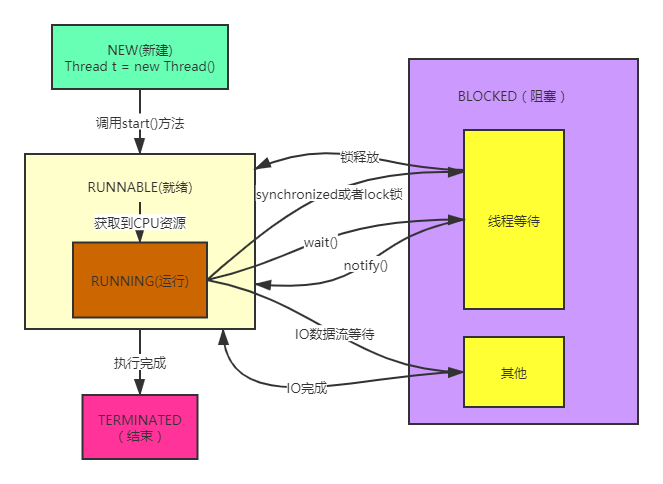
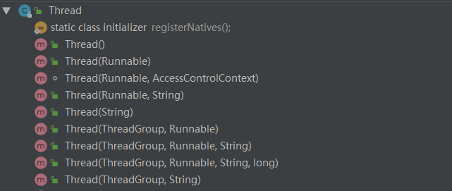
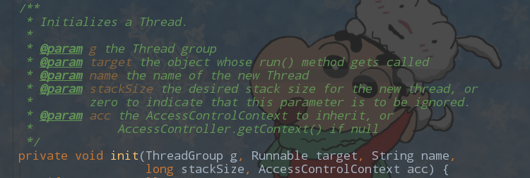

# java线程详解
## 线程
### 概念
说到线程，就不得不提进程，为什么呢，因为进程是操作系统进行分配资源和调度的最小单位，比如windows系统安装的应用软件（office、qq、微信等）启动时，由操作系统协调分配资源和调度执行称之为一个进程，进程间是相互独立和隔离的。而线程是进程最小执行单位，一个进程的执行过程中可以有多个线程，这样可以发挥多核CPU的能力，提高执行效率。
java中的线程不是由操作系统直接调度，而且通过java虚拟机与操作系统进行指令交互完成。所以对于java程序员来说，使用线程非常简单，只需要在语言层面编写完代码，交给虚拟机运行，剩下的脏活累活在底层就由java虚拟机完成，使用线程一时爽，一直使用一直爽（哈哈，虽然多线程能充分压榨CPU，但是用不好的话也会产生许多问题，比如并发导致的数据错误、系统负载飙升等）。

### 基本用法

有两种方式来创建线程
1、一种是实现`Runnable`接口，然后利用`Thread`类的构造函数传入Runnable接口创建`Thread`实例。
2、另外一种是继承`Thread`。

1、实现Runnable
```java
class WorkerThread1 implements Runnable {
    @Override
    public void run() {
        System.out.println(Thread.currentThread().getName() + "执行完成");
    }
}
```
2、继承Thread
```java
class WorkerThread2 extends Thread {
    @Override
    public void run() {
        System.out.println(Thread.currentThread().getName() + "执行完成");
    }
}
```
测试用例：
```java
public static void main(String[] args) {
    test1();
}

private static void test1() {
    new Thread(new WorkerThread1(), "t1").start();
    Thread t2 = new WorkerThread2();
    t2.setName("t2");
    t2.start();
}
```
输出：
注意这里的执行顺序不一定是t1先输出，也可能是t2先输出，因为线程启动后只是准备就绪，最终需要等待操作系统调度执行才能执行。
```
t1执行完成
t2执行完成
```
这两种方式都可以创建线程并执行，细心的读者可能看过源码发现其实`Thread`类也实现了`Runnable`接口。如果自己的类已经继承了别的类，那么可以实现`Runnable`接口创建线程，否则可以继承`Thread`类复写`run()`方法即可。
> 注意：要让线程执行需要调用`start()`方法，这样虚拟机才能创建一个线程等待操作系统调度，直接执行`run()`方法则是在当前线程直接调用该方法，同步执行，不会再创建线程。
### 线程状态及流转
线程的生命周期可用状态表示，总共有6种状态，
`Thread`类的源码里我们可以看到有个枚举类`State`。

```java
public enum State {
    // 新建状态，被new出来后，还未调用start方法
    NEW,
    // 可运行状态，线程已就绪，获取到CPU资源就运行，运行中就是Running状态
    RUNNABLE,
    // 阻塞状态，比如在等待锁对象，或者读取流等待
    BLOCKED,
    // 等待状态，比如在等待锁对象，需要被notify唤醒处于就绪状态，获取到CPU资源就运行
    WAITING,
    // 带有超时时间的等待，时间过后自动返回继续执行，比如sleep或者wait(long time)
    TIMED_WAITING,
    // 终止状态，自然停止或者抛出异常停止
    TERMINATED;
}
```
状态流转图：


### 属性及方法
#### 属性
常用并且需要关注的属性如下：
```java
private int priority;// 线程优先级，1<=priority<=10,优先级越大可能最终被操作系统优先调度的几率越大，但不一定会被先调用
private boolean daemon = false;// 是否后台线程，当所有的非后台线程结束时，所有的后台线程才结束，比如垃圾回收线程就是后台线程，负责在程序运行过程中，清理掉不在使用的对象
private Runnable target;// 目标类，要使用线程执行的业务逻辑写在run()方法里
private ThreadGroup group;// 线程组，所有的线程都必须属于某一个线程组，默认的是父线程组，未创建线程组时即main线程组
ThreadLocal.ThreadLocalMap threadLocals = null;// 线程独享本地变量表
```
`ThreadLocal`不了解的童鞋可以参考`ThreadLocal源码分析`
#### 构造方法

其实最终都会调到一个`init`的方法，这里会初始化一些线程的基本信息。


```
ThreadGroup g：属于的线程组（每个线程必须属于一个线程组，没有设置线程组的话这里会默认使用父线程组，即main线程组）
Runnable target：要执行的方法
String name：线程名字，可单独设置，默认使用的是`Thread-自增序号`
long stackSize：这只线程占用的栈大小，一般不设置，由java虚拟机决定
AccessControlContext acc：这是一种安全访问机制，一般不用自己设置。
```
#### 常用方法
```java
// jvm方法，获取当前正在执行的线程
public static native Thread currentThread();
// 调用该方法所在的线程通知让出CPU资源，由操作系统重新分配线程执行，有可能还是该线程继续执行
public static native void yield();
// 线程休眠millis毫秒，让出CPU资源，但是不会释放持有的对象锁，当被中断时抛出异常
public static native void sleep(long millis) throws InterruptedException;
// 启动线程，更合理的说法是线程准备就绪，等待最终操作系统调度执行
public synchronized void start()
// 中断线程，其实只是设置中断标志为true，如果线程已经终止，调用该方法不会有任何作用，线程自身和安全验证通过的线程才有权限调该线程的这个方法，否则会返回异常SecurityException，还有以下几种特殊场景。
// 1、如果当前线程处理wait()、join()、sleep(long)方法时中断标志将被清除，并且抛出异常InterruptedException。（清除中断标志是因为抛出了异常后可由程序控制执行，中断标志没啥意义了）
// 2、继承了InterruptibleChannel如果IO阻塞状态，则channel会关闭并且中断标志设置为true，抛出异常ClosedByInterruptException
// 3、如果该线程阻塞在Selector，则中断标志设置为true并且select会立即返回一个非0的值表示select方法执行了
public void interrupt()
// 返回当前线程是否处于中断状态，并清除当前运行的线程的中断标志。
public static boolean interrupted() {
    return currentThread().isInterrupted(true);
}
// 返回当前线程是否处于中断状态,不会清除当前运行的线程的中断标志。线程终止后该方法始终返回false
public boolean isInterrupted() {
   return isInterrupted(false);
}
```
### 常用场景
重点看下`interrupt()`、`interrupted()`、`isInterrupted()`这三个方法的使用。
1、不使用变量终止线程
下面示例调用了`interrupt()`方法

```java
public class ThreadTest {
    public static void main(String[] args) throws InterruptedException {
        Thread t = new Thread(new Runnable() {
            @Override
            public void run() {
                while (true) {
                    System.out.println(Thread.currentThread().getName() + ":" + System.currentTimeMillis());
                }
            }
        }, "t1");
        t.start();
        //主线程休2秒
        Thread.sleep(2000);
        t.interrupt();
        System.out.println(Thread.currentThread().getName() + "运行结束");
    }
}
```
程序运行部分结果
```java
t1:1584607075440
t1:1584607075440
t1:1584607075440
t1:1584607075440
main运行结束
t1:1584607077740
t1:1584607077740
t1:1584607077740
t1:1584607077740
t1:1584607077741
t1:1584607077741
t1:1584607077741
```
这里我们看到调用了`interrupt()`方法，但是t线程并没有终止，因为这个方法只是设置中断标志为true，线程是否结束跟这个标志没有关系，需要其他逻辑判断。
如果我们把程序的while循环的条件调整如下这样，那么t线程调用`isInterrupted()`方法获取到中断标志为true，!true条件结果为false所以while循环结束，线程自然终止。

```java
while (true) 
改成
while (!Thread.currentThread().isInterrupted())
```
2、线程组的操作
线程组主要是可以管理线程或线程组，一个大型的线程组看起来像是一棵树，可方便的对线程和子线程组进行监控和操作，比如统计活跃线程和线程组，或者中断和销毁线程组操作等。

```java
public static void main(String[] args) {
    ThreadGroup tg1 = new ThreadGroup("tg1");
    ThreadGroup tg2 = new ThreadGroup("tg2");
    ThreadGroup tg3 = new ThreadGroup(tg2, "tg3");
    Thread t1 = new WorkerThread(tg1, "t1");
    Thread t2 = new WorkerThread(tg2, "t2");
    Thread t3 = new WorkerThread(tg1, "t3");
    Thread t4 = new WorkerThread(tg3, "t4");
    t1.start();
    t2.start();
    t3.start();
    t4.start();
    System.out.println("tgName:" + tg1.getName() + "\tactiveCount:" + tg1.activeCount());
    System.out.println("tgName:" + tg2.getName() + "\tactiveGroupCount:" + tg2.activeGroupCount());
    System.out.println("tgName:" + tg3.getParent().getName() + "\tactiveGroupCount:" + tg3.activeGroupCount());
}
    
class WorkerThread extends Thread {
    public WorkerThread(ThreadGroup tg, String name) {
        super(tg, name);
    }
    @Override
    public void run() {
        while (true) {
        }
    }
}
```
输出结果如下：
```
tgName:tg1	activeCount:2
tgName:tg2	activeGroupCount:1
tgName:tg2	activeGroupCount:0
```
## 总结
线程的使用可以提高系统的处理能力，比较复杂的业务可以使用多线程协作缩短执行时间，线程的结束不能仅仅依靠中断，需要根据业务实现自己的逻辑。另外引入多线程会增加系统的复杂度，线程的管理问题也会比较麻烦，同时线程数过多会频繁的让CPU切换，增加系统负载，这种时候可以选择使用线程池来解决问题，后续会再详细介绍。

## 公众号
欢迎关注公众号，不定期的发布java相关的技术文章。

